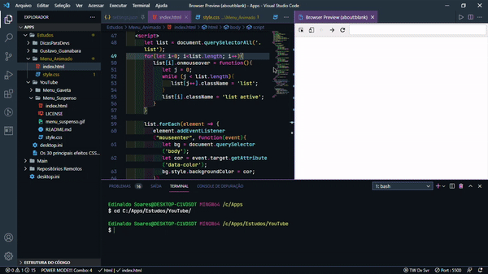

<h1 *align*="center">Menu Animado</h5>

  

# Menu_Animado
Construção de um menu animado.

## Tarefas
 O controle das tarefas desse projeto será realizado abaixo.

 * Estrutura inicial

 * Estilização da estrutura

 * Ações dos elementos

 * Finalização do projeto.

## Ícones

- 📦 Nova funcionalidade

- 🔄 Atualização

- 🐛 Correção de bug

- 🏁 Lançamento

  

- Praticando o conhecimento de HTML, CSS e Javascript na construção de um menu animado.